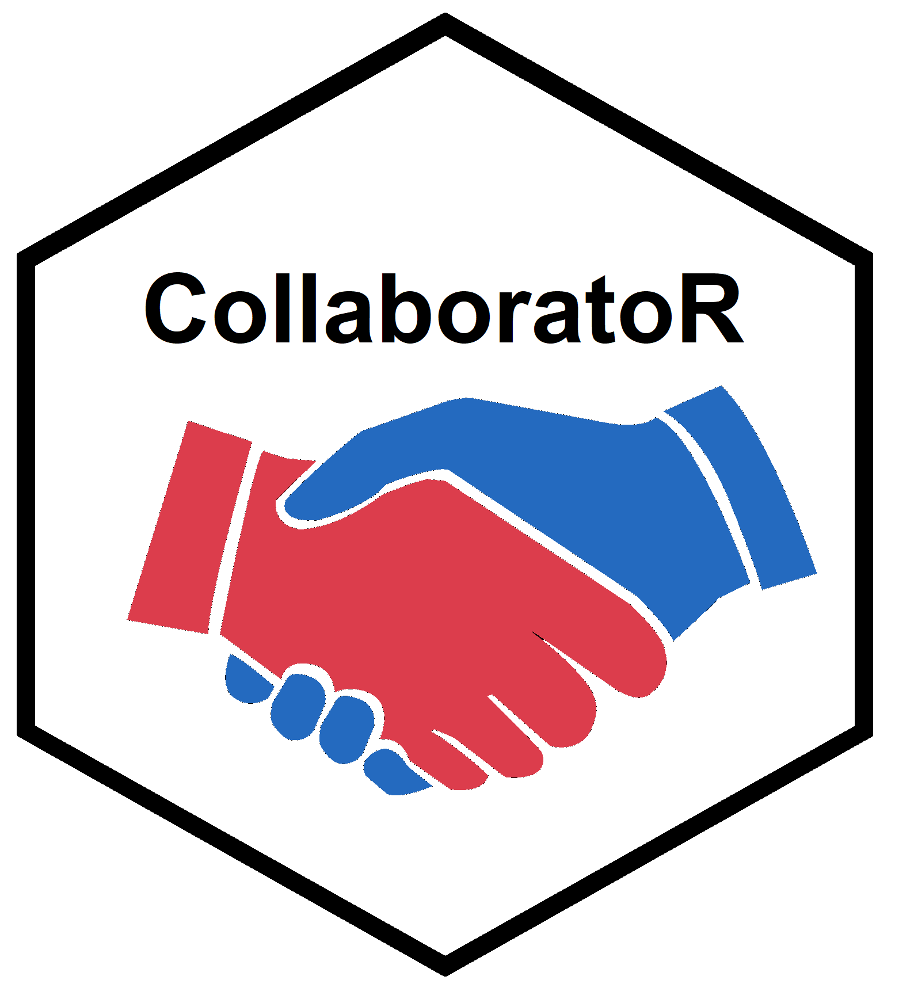

collaboratoR
==========



The `collaboratoR` package provides functions which help facilitate administration of multi-centre research using R and the [REDCap](https://www.ncbi.nlm.nih.gov/pmc/articles/PMC2700030/) (Research Electronic Data Capture) application. These functions have been developed and utilised within several collaborative research projects from:

- [**Student Audit and Research in Surgery (STARSurg)**](https://www.starsurg.org)
  - [Outcomes After Kidney injury in Surgery (OAKS)](https://starsurg.org/oaks-2/)
  - [REspiratory COmplications after abdomiNal Surgery (RECON)](https://starsurg.org/recon-project-18-19/)
<br><br>
  
- [**EuroSurg**](http://www.eurosurg.org)
  - [Ileus Management International (IMAGINE)](http://eurosurg.org/imagine-hub/)
  - [Management of COMPlicAted intra-abdominal collectionS after colorectal Surgery (COMPASS)](http://eurosurg.org/compass-study-hub/)
<br><br>

- [**GlobalSurg**](http://globalsurg.org/)
  - [GlobalSurg 3: Quality and outcomes after global cancer surgery](http://globalsurg.org/projects/cohort-studies/globalsurg-3/)
  - [CovidSurg](https://globalsurg.org/covidsurg/)
<br><br>

- [**West Midlands Research Collaborative (WMRC)**](http://www.wmresearch.org.uk)
  - [Oesophago-Gastric Anastomosis Audit (OGAA)](https://ogaa.org.uk/)
<br><br>

All functions have been developed with the aim of being applicable to a broad range of REDCap projects. Any suggestions for further functions are welcome, however these would need to be aligned with this aim.

If the CollaboratoR package is used within your project, please e-mail the authors [here](mailto:v1kmcle6@ed.ac.uk) so the list above can be updated. Please also consider citing the package in any resultant publications with the suggested format: "McLean KA, Ots R, Drake TM, Harrison EM. *CollaboratoR: Scalable multi-centre research using R and REDCap*. 2019. Avaliable at: [https://github.com/kamclean/collaborator](https://github.com/kamclean/collaborator)."

Installation and Documentation
------------------------------

You can install `collaborator` from github with:

``` r
# install.packages("devtools")
devtools::install_github("kamclean/collaborator")
```

It is recommended that this package is used together with `tidyverse` packages.

Furthermore, functions to faciliate analysis of data collected in R can be found in the [finalfit](https://github.com/ewenharrison/finalfit/blob/master/README.md) package.

Vignettes
---------
[Generating Redcap Summary Data](https://github.com/kamclean/collaborator/blob/master/vignettes/vignette_summary.md)

[Redcap User Management: 1. Explore Current Users](https://github.com/kamclean/collaborator/blob/master/vignettes/vignette_user_1_explore.md)

[Redcap User Management: 2. Automatically Assign User Rights](https://github.com/kamclean/collaborator/blob/master/vignettes/vignette_user_2_assign.md)

[Generating Authorship Lists](https://github.com/kamclean/collaborator/blob/master/vignettes/vignette_authors.md)

[Generating Missing Data Reports](https://github.com/kamclean/collaborator/blob/master/vignettes/vignette_missing.md)

[Generating a Simple, Easily-Shareable Data Dictionary](https://github.com/kamclean/collaborator/blob/master/vignettes/vignette_data_dict.md)

[Mailmerge in R with personalised attachments](https://github.com/kamclean/collaborator/blob/master/vignettes/vignette_email.md)
