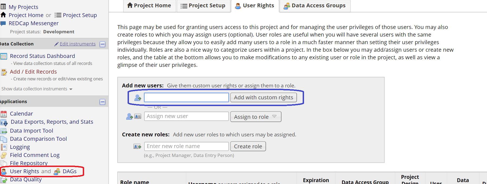
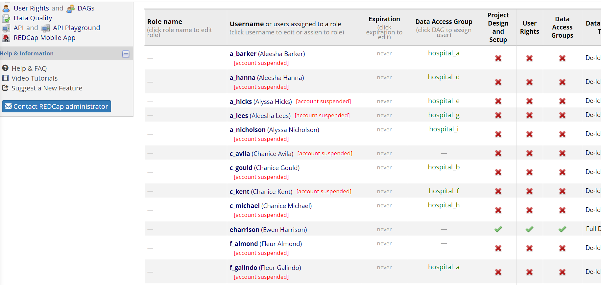

 
First always load the packages you need - we are going to be using collaborator and will be doing data wrangling.
```{r setup, echo = TRUE}
knitr::opts_chunk$set(echo = TRUE)

# load required packages
library(tidyverse); library(collaborator); library(knitr)

# Load REDCap access
myproject_uri = "https://redcap.cir.ed.ac.uk/redcap_v8.4.5/API/"
myproject_api = "582D6629348CB3AED679BCADE20969DA"

```

&nbsp;

## **Add new users to REDCap**

#### **Step 1**: Create a user manually on REDCap via user rights

 - Ensure to give them the exact rights you want everyone else in their role to have (e.g. data collector, data validator, etc).

 - Lets say you made "a_barker" who is in the "data collector" role. She can make and edit new records, but not much else.
 
```{r user_page, echo=FALSE}

```
 
```{r get_user_new, echo=FALSE}
user_new <- RCurl::postForm(uri = myproject_uri, token = myproject_api,
                content='user', format='csv', raworLabel="raw") %>%
  readr::read_csv() %>%
  dplyr::select(username, firstname, lastname, email,data_access_group) %>%
  dplyr::filter(! username %in% c("a_barker", "eharrison", "kmclean", "y_o'doherty"))
```

&nbsp;

#### **Step 2**: Create a dataframe of all new users with the **same** role (e.g. data collectors like "a_barker")

 - This is the minimum information to add a new user to redcap.
 
 - Please note all names are randomly generated.
 
```{r show_user_new, echo=TRUE}
user_new
```

&nbsp;

#### **Step 3**: Create REDCap user accounts for the new users.

 - People need to be users on REDCap before they can be added to a specific REDCap project.
 
 - This can be done via "Create users (bulk upload)" in the "Control Centre" (requires admin access). **There is no capability to automate currently, but can at least be done en-masse).**
 
 - This requires a specifically formatted csv (spreadsheet) file, which `user_import()` provides.
 
```{r user_import, echo=TRUE}
user_new %>%
  collaborator::user_import(username = "username",
                            first_name = "firstname", last_name = "lastname",
                            email = "email", institution = "data_access_group")

# Change the name of one of the user_new variables using mutate(). Change the corresponding name in the user_import function above.

# This can be saved using `readr::write_csv()`, then exported - try that now.
```
 
 &nbsp;

#### **Step 4**: Generate the user accounts by uploading via "Create users (bulk upload)" in the "Control Centre"

 - For our purposes, imagine we have now done this.
 
&nbsp;

#### **Step 5**: Create "data access groups" manually on the REDCap project
 
  - In the grey box below, check how many `unique()` "data_access_group" in the `user_new` dataframe.

```{r dags, echo=TRUE}


```

 - These can be done via "DAGs" (next to user rights) in your project. **There is no capabiity to automate currently, and need to be done one-by-one** 
 
 - For our purposes, imagine we have now done this.

&nbsp;

#### **Step 6**: Assign the users to the REDCap project you want.

 - Now we're at the exciting part :P.
 
```{r user_assign, echo=TRUE}
collaborator::user_assign(redcap_project_uri = myproject_uri, # specifying the REDCap project
                          redcap_project_token = myproject_api, # specifying the REDCap project,
                          users.df = dplyr::select(user_new, username, data_access_group), # we want these new users
                          role = "a_barker") # to have the same user rights as this person (data collector)
```

 - So the function has told us that 33 new users have been successfully uploaded (it'll show an error in red if it hasn't worked for a specific user).
 
**DISCLAIMER: The downside to automatic user allocation using this method is that “user roles” cannot be assigned from outwith REDCap. Therefore, should the user rights of the group need to be edited afterwards it is highly recommended to be done via re-application of this method (otherwise each individual users would need to be allocated to a role (and then edited), or their rights would need to manually edited individually).**

 - It is **highly** recommended that the "user role" feature of REDCap is **NOT** used if you plan to use this method (it can interfere with the process).

 - If you want to edit the rights for these users, just change the rights for 1 user, then reapply this method with their username supplied to `user_assign()`.

- Read more about this process in the [online vignette](https://github.com/kamclean/collaborator/blob/master/vignettes/vignette_user_2_assign.md)
 
&nbsp;
&nbsp;

## **Check current users on REDCap**

### **`user_validate`**

One of the single most important functions in this package is `user_validate()`. Huge administrative headaches happen if users are uploaded to the wrong data access groups, or with the wrong user rights. 

`user_validate()` compares users you wanted to upload to users actually on the REDCap project. This is particularly useful if you want to check users who have been manually uploaded for any human errors.
 
&nbsp;

```{r user_valdiate,echo = TRUE}
suppressWarnings(collaborator::user_validate(redcap_project_uri = myproject_uri, # specifying the REDCap project 
                                             redcap_project_token = myproject_api,# specifying the REDCap project
                                             users.df = user_new)) # users you wanted to upload

# Note: This does not pick up on all errors as it assumes the "users.df" data is correct.

```

Exactly what the output means and when it can occur is explained [here](https://github.com/kamclean/collaborator/blob/master/vignettes/vignette_user_1_explore.md). Simply put:

 - `$dag_incorrect` / `$forms_na`: Should never display anything (and requires urgent investigation if so).
 
 - `$dag_unallocated`: Should only be `NA` (DAG unallocated) for people you want to have access to the **entire project** (e.g. not data collectors). You can exclude people who are supposed to be unallocated from this check using the "users_exception" argument. E.g. Remove "kmclean" and "eharrison" using that method now.
 
&nbsp;

### **User roles**
As mentioned above, it is **highly** recommended that the "user role" feature of REDCap is **NOT** used if you plan to use the `user_assign()` method (it can interfere with the process).

This is nonetheless a useful feature, and can be mimicked using the following functions. 
 
&nbsp;

#### **Step 1**: Determine the unique "user roles" on the REDCap currently

 - This function groups people by their user rights, and each group is given a unique number shown in the "role" column.
 
```{r user_roles_n1,echo = TRUE}
myproject_users <- collaborator::user_roles_n(redcap_project_uri = myproject_uri,
                                              redcap_project_token = myproject_api)

myproject_users$full

 # Now use `table()` to determine how many people have each role.
 # At present, "role" is just a number so it's not very informative / useful!

```
 
&nbsp;

Now compare with the users listed on REDCap (it's the same).
```{r user_roles_n2,echo = TRUE}

```
 
#### **Step 2**: Assign a name to each role 

At present, "role" is just a number so it's not very informative / useful! You can get some information via "$examples" from `user_roles_n()` which gives you an example user with that role.
 
```{r user_roles_n4,echo = TRUE}
myproject_users$examples
```
 
&nbsp;

Let's say you know "a_barker" is a "data collector", "eharrison" is a "validator", and "kmclean" an "administrator". You can use this information to label the roles.

```{r user_roles_n5,echo = TRUE}
user_examples <- myproject_users$examples %>%
  dplyr::mutate(role = factor(role,
                       levels=1:nrow(.),
                       labels=c("data collector","validator", "administrator"))) %>%
  dplyr::mutate(role = as.character(role))

```
 
&nbsp;

#### **Step 3**: Apply the "user roles" to the user dataframe on REDCap

```{r user_roles_n6,echo = TRUE}
myproject_users2 <- collaborator::user_roles(redcap_project_uri = myproject_uri,
                                             redcap_project_token = myproject_api,
                                             role_users_example = user_examples) # labelled roles with an example user.

myproject_users2
```

This has a variety of uses beyond just checking if uploaded properly - you can single out specific groups to change their user access (maybe changing "edit" to "view" access once the project is done). Or you can use to make plots / tables with the data.

&nbsp;

**Example*: Try to make a plot or table below using the "role" data.
```{r user_role_visualise,echo = TRUE}

# Use myproject_users2


```

&nbsp;
