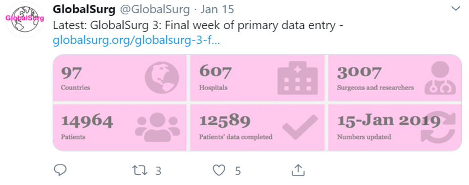
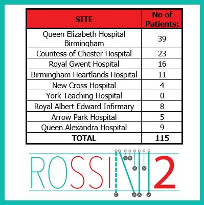

 
First always load the packages you need - we are going to be using collaborator and will be doing data wrangling.
```{r setup,echo = TRUE}
knitr::opts_chunk$set(echo = TRUE)

# load required packages
library(tidyverse); library(collaborator)

# Load REDCap access
myproject_uri = "https://redcap.cir.ed.ac.uk/redcap_v8.4.5/API/"
myproject_api = "582D6629348CB3AED679BCADE20969DA"
```


## Generation

```{r redcap_sum,echo = TRUE}
redcap_sum(redcap_project_uri = myproject_uri, redcap_project_token = myproject_api)
```

## Communication

#### **GlobalSurg 3 updates**
```{r example_fig1, fig.align = "center", echo=FALSE}

```

&nbsp;

Now let's recreate the data needed for this using redcap_sum:
```{r redcap_sum_example1,echo = TRUE}
redcap_sum(redcap_project_uri = myproject_uri, redcap_project_token = myproject_api)$sum_overall
```

#### **ROSSINI-2 updates**
```{r example_fig2, fig.align = "center", echo=FALSE}

```

&nbsp;

Now let's recreate this using redcap_sum():

```{r redcap_sum_example2_1}
  # Step 1: Get summary data for all DAG
  redcap_sum(redcap_project_uri = myproject_uri, redcap_project_token = myproject_api)$dag_all %>%
  
  # Step 2: Select only the "dag" and "record_all" columns (and rename at the same time)
  dplyr::select("Site" = dag, "No of Patients" = record_all) -> table_rossini

table_rossini # saved table "object"
```

&nbsp;

Good, but we're missing the "Total" row
```{r redcap_sum_example2_2}
  # Step 3: Create an extra "Total" row (loads of ways to achieve this)
tibble::tibble("Site" = "Total", 
               `No of Patients` = sum(table_rossini$`No of Patients`)) -> table_rossini_total

  # Step 4: Join rows together
  dplyr::bind_rows(table_rossini, table_rossini_total)
                                  
```

&nbsp;

So in 5 lines we've recreated this output in a way that can be ran repeatedly to always get the most up-to-date version. This can be exported and used to make that tweet.

(If you wanted to show off, you could recreate the aesthetics exactly (colours), and post onto Twitter from R :P).

&nbsp;

## Exercise (solutions will be sent separately)

1. Look at the "dag_top_n" output from "redcap_sum". Note this is only 10 (default number), what if you want more/less? Use the "n_top_dag" to change the number

2. Go to "Help" in the bottom R corner of the screen and type "redcap_sum" into the search bar. See what else you can add under "Arguments".

&nbsp;
