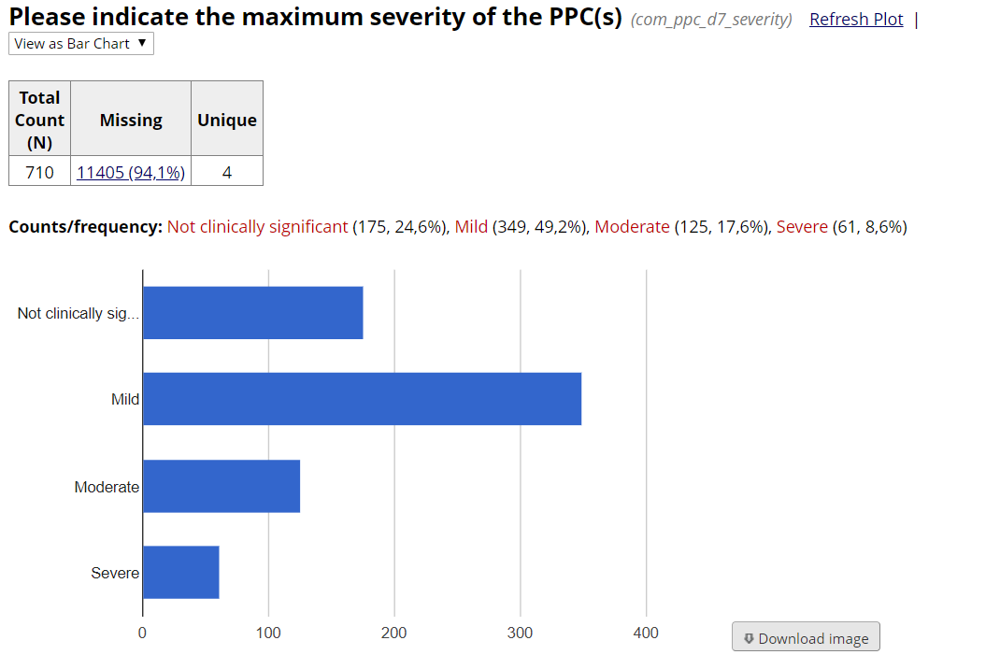

```{r setup, include=FALSE}
knitr::opts_chunk$set(echo = TRUE)

# load required packages
library(tidyverse); library(collaborator);library(knitr)

# Load REDCap access
myproject_uri = "https://redcap.cir.ed.ac.uk/redcap_v8.4.5/API/"
myproject_api = "582D6629348CB3AED679BCADE20969DA"

```

Ensuring high levels of completeness within research projects is an important task for ensuring the highest quality dataset for subsequent analyses. However, determining what data is missing within a REDCap project, particularly accounting for appropriately missing data (such as in the case of unfulfilled branching logic) can be a challenging and time-consuming task to produce in real-time.

**For example, look at this chart REDCap can produce to check missing data:**
```{r example_fig1, fig.align = "center", echo=FALSE}

```

REDCap is telling us we have 94.1% missing data for this variable (*oh no!*). However, there is no point asking about the severity of postoperative pulmonary complications (PPC) if they don't have one (so this question only appears when the data collectors say a PPC has happened). Technically this data is "missing" for the patients who don't have a PPC, but it is **supposed** to be missing! (and collaborators obviously shouldn't be penalised for that).

But how do we tell the difference? No-one wants to check that manually and REDCap can't tell us itself, which is where `report_miss()` comes in.

The `report_miss()` function is designed to easily produce a high quality and informative report of missing data at a data_access_group and individual record level.

This report highlights all missing data within a REDCap project (but differentiates between appropriately missing and genuine missing data), while removing all other data (so this can be shared in line with duties of data protection).

## **Report generation**

```{r example1, echo=TRUE}
myproject_missingdata <- collaborator::report_miss(redcap_project_uri = myproject_uri,
                                                   redcap_project_token = myproject_api)

myproject_missingdata
```

What if you decide that some variables are less essential? (perhaps you won't exclude a record if missing). Pick 3 variables to exclude using the `var_exclude` argument and see how that affects your level of missing data.

```{r example2, echo=TRUE}
# Tip: use names() to get the names of the variables in the dataframe

# collaborator::report_miss()

```


See the [vignette on missing data](https://github.com/kamclean/collaborator/blob/master/vignettes/vignette_missing.md) online for more information on how to customise and interpret the results of `report_miss()`.

## **Report communication**
This missing data report can be run **as often as you want** to get a real-time impression (if desired), the limitation is being able to communicate it to others as quickly (whether steering group or directly to data collectors)

Options can include:

1. Export dataframe as a CSV files (spreadsheet) that can then be manually emailed to collaborators. Use the readr::write_csv() function to export the dataframe now.

```{r example3, echo=TRUE}
# This file can then be exported (tick the csv file -> More -> Export). Do this after you've saved this


```

2. Email from within R directly to collaborators (we did this for STARSurg RECON project - CollaboratoR function for doing this simply coming soon!)

3. Push from R to an online repository that collaborators can access (could be google sheets, back to a REDCap project, GitHub, or somewhere else).

These are all possible, but have pros/cons (mostly around complexity). 


#### **Advanced exercise**

We are going to split up the datasets by DAG (so we avoid having to do this manually).

We will also be using the `purrr::map()` function, which is really useful as that lets you apply the **same** function across multiple things (e.g. multiple datasets that share characteristics).

First, create a "New Folder" called anything (example: "folder")

Next use the code below:
```{r example4, include=FALSE, echo=TRUE}
  # Take the record-level missing dataset
myproject_missingdata$data_missing_record %>%
  
  # Split by DAG into separate datasets 
  dplyr::group_split(redcap_data_access_group) %>%
  
  # We want to make a csv file (readr::write_csv) for each dataset (x).
  
  # path tells R where you want to save the files. We are going to save the dataset within the folder (folder/) by the name of the DAG (redcap_data_access_group), and save it as a csv file (.csv).
  
  # For example this might be saved as "folder/miss_hospital_a.csv".
  purrr::map(function(x){readr::write_csv(x = x,
                                          path = paste0("folder/miss_",
                                                        unique(x$redcap_data_access_group),
                                                        ".csv"))})
  
# This can then be exported as a zip folder (tick name_of_folder -> More -> Export). Do this now.

```

&nbsp;
